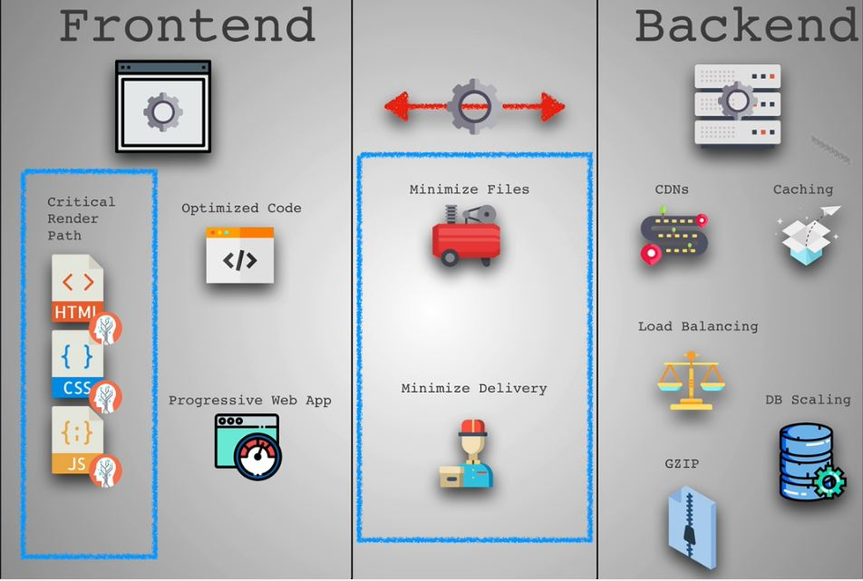
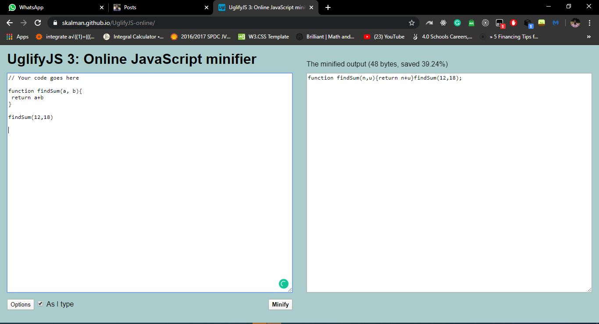

## Performance (Part 1)

There are so many ways to improve the performance of your web app, so in this first part, we'll be looking at one of the many ways in which you can actually do that.

As a web developer, it is very important for you to realize that internet speed isn't the same for everyone of your user, so it is important to always take performance into consideration. Always prioritize fast user experience.

Just a few seconds of delay can lead to large consequences, some of which I discussed in my previous artice about [Progressive Web Apps](https://codexplorer.me/posts/pwa-who-cares). I'll give some more examples, studies showed that a 1 second speed delay on Amazon's site could lead to a loss of 1.6billion in sales. Same with google, 4/10th of a second (0.4s) speed delay in displaying search result, could reduce total searches by 1 million a day, there by reducing income from services like GoogleAds.

There are lots of ways to increase your code/website performance. We will focus on what gets you 80% of the benefits over 3 series.

---
Remember, your visitors expect your site to load after 2 second, 50% of visitors leave if it takes longer than that.
---

There are 3 keys to performance.

When a website is displayed, work happens on 3 major fronts.

*   Client side (front-end)
*   File transfer over wire (network latency). Every request need time to travel to the server and back. Statistically speaking, an average website makes 100 requests before it loads completely.
*   Backend processing.

To make our websites as fast as possible, we should improve something in all of these sections. 

Before we jump into steps. When optimizing your site, but you have no idea of what is slowing it down or you don’t have any benchmark or comparison, to be sure you're actually improving your speed, then you're simply clowning.

## Network performance.
The internet as you know, is basically subsea cables, wires, satellites, signal towers, connecting a group of computers to one another.

Everytime you open up your browser, you have to send a request to a server somewhere to get the necessary files needed by your browser to display a webpage.

So let's talk about ways we can improve your network performance. As I've learnt, I like to break them down to two sections:
*   The Juice extraction
*   The tired errand boy

Lol, those are two really weird names, but soon you'll understand the meaning and why it makes sense.

Recall that we need to download files to display a webpages, therefore, the more kilobytes (kb) we need to download, the longer it takes the webpage to display.

Since these files are also transferred over the internet, we should ensure they are as light as can be.

## The Juice Extraction

The process of extracting juice reduces the size of the fruit and only leaves us with what we desire to savour; the juice. Similarly, we need to reduce the size of our site files.

This reduces the data we need to transfer. Lets get into the how to.

## How to minimize text files

This can be achivied by using tools such as [uglifyJS](https://skalman.github.io/UglifyJS-online/).

> Notice how it eliminates all forms of indentation and the space saved is 39.24%(48bytes). Imagine the amount of space saved with thousands of lines of code.

Machines read code and don't care about indentation or function names. You could do this manually; I mean minifying your files. Now, its all part of a build process, thats to tools like webpack, parcel.js. When an application is ready for production, you use one of the tools mention to make them smaller.

## Lets talk about minimizing images.

Images are one of the easiest things to improve on your website. Also, they are the most commonly misused to slow down your website.
The primary way to change an image, is to change the file format to one that's best for the job. 

---
Lets look a different file formats for images and their attributes:
---

*   JPG - Used for complex photos/images with many colours. It doesn't make provision for transparency and they tend to be a little large in size.
*   PNG - Limit the number of colours you can use and that is why they are usually smaller than JPG. Their transparency makes them suitable for logos.
*   GIF - Usually greeny and oddly coloured, because they also limit the number of clours you can use, which is why they are suitable for short animations with decent sizes.
*   SVG - A completely different category , they are vector graphics. They can be expanded and still retain their sharpness and clarity. They are customizable with css.

There are etons of resurces online about modern image formats such as JPG200, jpfxr, webp. They are all superior in quality characteristics compared to older counterpart, but they don't have the a wide range of browser support.

> The goal is to pick the right image format & compress them without reducing their quality.

So, in summary when dealing with images the are 10 commandments.

---
## 10 commandments
---

*   If you need transparency - PNG
*   Animation - GIF
*   Colourful images - JPG
*   Simple icons, logos, illustrations - SVG
*   Reduce PNG with [TinyPNG](https://tinypng.com/)
*   Reduce JPG with [JPEG-optimizer](http://jpeg-optimizer.com/)
*   Try to choose simple illustration over highly detailed photo
*   Always lower JPG quality (30 - 60%)
*   Display different sized images based onn use screen (learn to use media query)
    Why the hell would you want to use the same image for an XL desktop for your mobile user.
*   Use CDNs like imigx

> Bonus tips: Remove image metatag

What is image metatag?
When you take a photo, it stores certain data, such as date photo was taken, where (long. & lat.), device used to capture and many more. This isn't only good for performance because its unnecessary information (you get to save a couple of kb), but it's also good for security reasons too. 

Now I think we know out to juice our files, to get what we savour and need only.

## The Tired Errand Boy

The more components your webpage requires, the more http requests are made. I'm not saying you should omit content, just means consider structuring your codebase more efficiently. We don't need to send every single file down the wire, only the ones we need.

Try to get rid of unnecessay libraries that add extra files. They might be convinient but not always necessary. Example, there are a lot of jquery functions that have been simplified with new methods in JavaScript. [Check them out](https://wwww.youmightnotneedjquery.com).

Now, in case you're wondering, why doesn't the errand boy just pick them all up at once, recall there is a limit to the number of concurrent requests your browser can make at once.Also, there is a size limit the errand boy can carry, he's not superman.

In summary:
*   Combine files when you can
*   Reduce trips
*   Reduces size

Well, that will be all for now. In the part 2, we will be talking about the critical render path, code review and code splitting.
Hope your enjoyed this post 😁.

Want to know more about optimization, feel free to check out my article about [Progressive Web Apps](https://codexplorer.me/posts/pwa-who-cares).