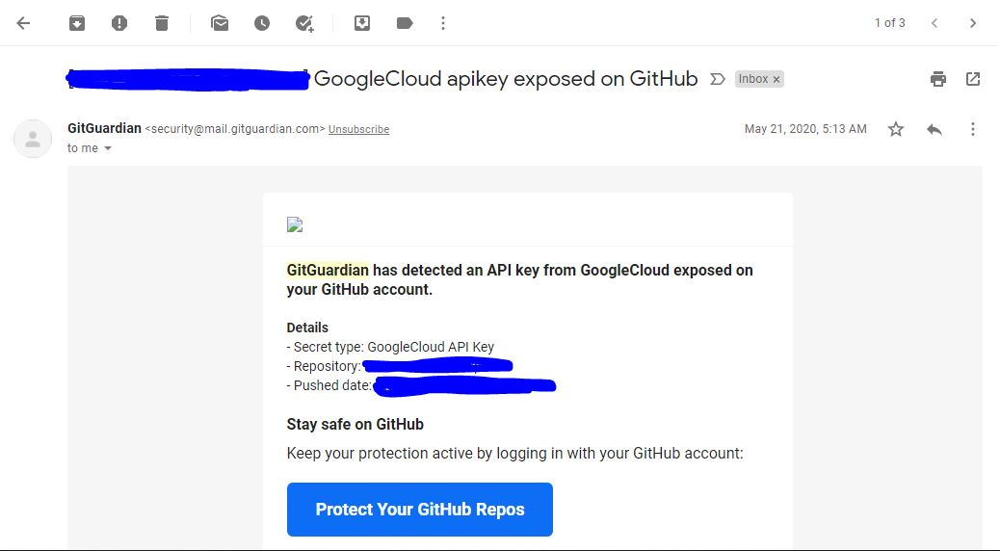
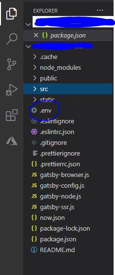

## First of all, what are environment variable and why are they important?

According to [ComputerHope](https://www.computerhope.com/jargon/e/envivari.htm#:~:text=An%20environment%20variable%20is%20a,to%20find%20user%20profile%20settings.), "An environment variable is a dynamic "object" on a computer, containing an editable value, which may be used by one or more software programs in Windows. Environment variables help programs know what directory to install files in, where to store temporary files, and where to find user profile settings. They help shape the environment that the programs on your computer use to run."

Environment variables are very important in helping you store sensitive information needed to run your programs secure. They can also be used to customize variable based on your environment, development, production, or staging

It is highly recommended to never write your credentials directly into your code, such as API keys. If you've made this mistake previously, you might have come across the GitHub message below.



## How do I make use of environment variables in my code?

There are two ways to do this:
---
*   Using a `.env` file to set variables
*   Through the shell (this will only last while the session is yet to expire)

---
## Using a .env file to set variables.
---
*   Step One: Go to the root folder of your application and create a file called .env.



*   Step Two: Create a variable following the convention. Create React App enforces the use of the `REACT_APP` prefix for all variables created, else it will be ignored when bundling.

```jsx
REACT_APP_VARIABLE1=ABCDEGF
REACT_APP_VARIABLE2=HIJLKMN

//there is no need to put variable value is quotes, as seen below
REACT_APP_VARIABLE1="ABCDEGF"
```

*   Step Three: Use the variables created in your front-end code using `process.env.VARIABLE_NAME`. Remember, the variables created are read-only from your javascript file.

```jsx
console.log(process.env.VARIABLE1)
console.log(process.env.VARIABLE2)
```

## What if you need to create multiple .env files?

You might need to create multiple `.env` files for different environments. E.g `.env` for production, `.env.development` for development.

---
Note: We didn't postfix .production because it a common practice to use the original env file for the production build.
---

When dealing with multiple files, the naming convention remains the same as Step Two above, but webpack needs to pick the correct `.env` file based on the active environment.

To do this, install the `env-cmd` package.

```jsx
npm install env-cmd 

or

yarn add env-cmd
```
Now change the package.json file script section to make use of `env-cmd` command

```jsx
"scripts": {
 "start": "env-cmd -f .env react-scripts start",
 "start-prod": "env-cmd -f .env.production react-scripts start",
 "build": "react-scripts build",
 "test": "react-scripts test --env=jsdom",
 "eject": "react-scripts eject"
},
```
---

Note: Most hosting providers provide an option to add environment variables from the UI.
---