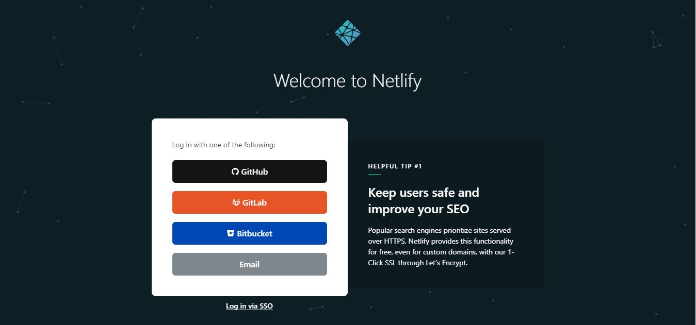
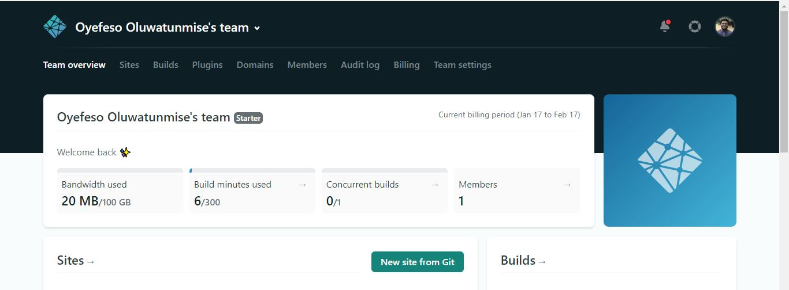
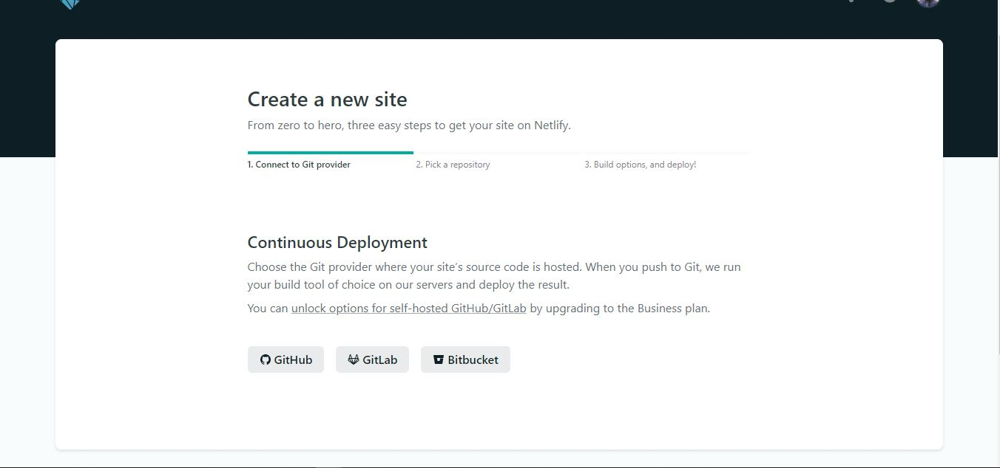
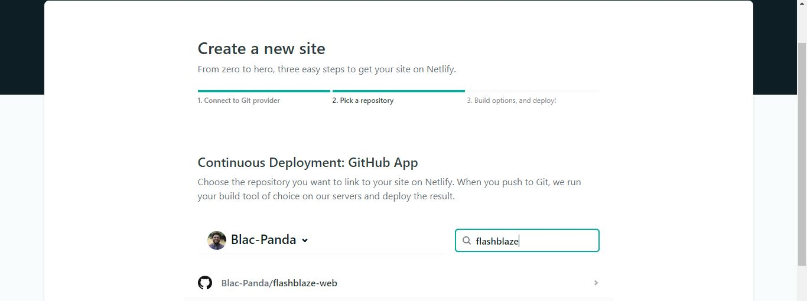
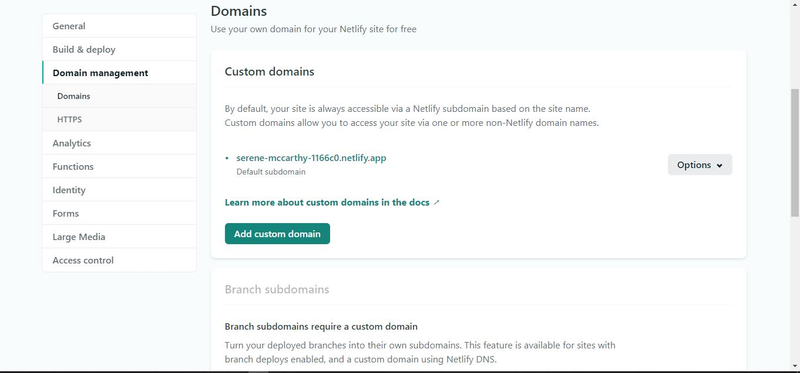
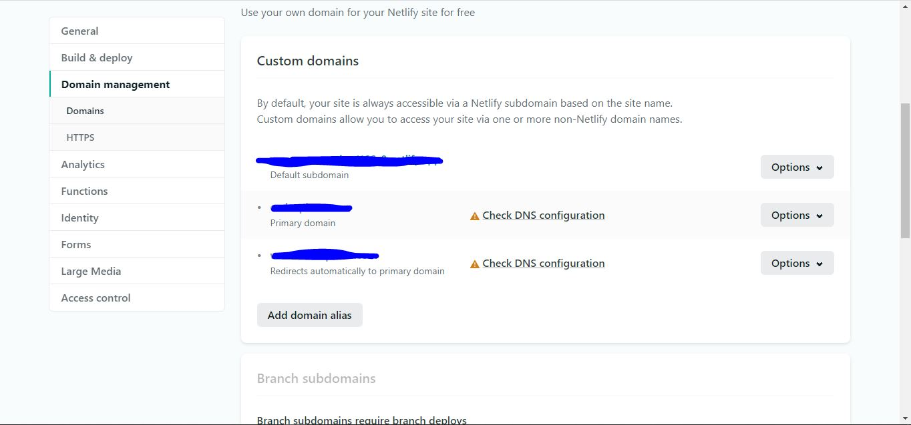
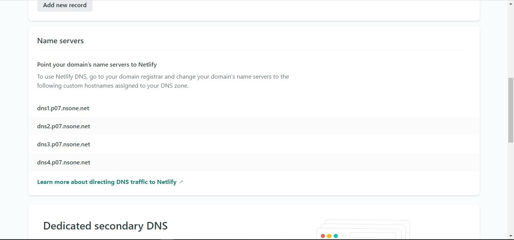

Over the course of this article, I will teach you how to deploy and host your react application on netlify. Aftwards, we’ll go on and set up mail server and dns records.

## What is Netlify ?

Netlify is a service that automates build and deployment of web applications. It’s one of the easiest and faster. Also, my personal favourite. 
It offers many other features to help manage your web application, which I will probably go over in the future.
Alright, let’s get started.

First of, you need to login or signup with the various options available.

To deploy a new site, click on ‘New site from Git’ button. For this project, I will be using a template of this blog, which is available at: https://github.com/Blac-Panda/flashblaze-website

Select the appropriate Git provider. This will then prompt you to select a repository.

The last step will be to review build settings, although it fills that in automatically. Also, if you are using any environment variables, ensure you add them by clicking on advanced to show the ‘add variable’ button.
 
![deploy-final](./assets/deploying-with-netlify/deploy-final.JPG0

## Linking to your custom domain.

Click on the application you will like to link, then go to domain settings.

Then you select add domain and input your domain. If you input a domain that is unowned and available for sale, it prompts you to add a payment method, so you can purchase the domain right away.

After add in your custom domain, your domain setting will look something like this: 

Click on the ‘DNS configuration’ for details on how to propagate your domain.

To use Netlify DNS, go to your domain registrar and change your domain’s name servers to the following custom hostnames assigned to your DNS zone.

> IMPORTANT: You should copy any/all required DNS records to the your Netlify DNS before changing the domain’s name servers to avoid possible interruption of services.

## What might happen if I don’t do this?
If you don’t copy required DNS records to Netlify when you switch, those records will stop working. These might be records for subdomains hosted outside of Netlify, email service, TXT verification records and many more.
I myself never took note of this till my email service started failing. Any email sent to my domain was rejected and returned to the sender.
You should prevent any kind of service interruption. Below we’ll discuss how to make DNS service change without disrupting other services.

## What is DNS?
DNS stands for domain name system. If you don’t know what DNS is, please take time to read more about it in this article I wrote. This section assumes that you know how to create DNS records with both your current DNS service and with Netlify DNS or any other Managed DNS of your choice.
Simply speaking, DNS is the mapping of IP addresses (which are actually 32 bit or 128 bit binary numbers) to domain names (human friendly strings).
DNS is what turns www.google.com into 2001:4860:4860::8844 .

If you do want to learn more about DNS here are a couple of articles to help you get started:
https://ns1.com/resources/dns-records-explained
https://www.digitalocean.com/community/tutorials/an-introduction-to-dns-terminology-components-and-concepts

## Which records do I copy?
Any required DNS records. You should be able to see your current DNS records in the web UI of your current DNS service. For example, in cPanel, this is found under Zone Editor
cpanel-dns.JPG
When you do find the records with your current DNS service, the only records you do not want to copy are records which will be different once the domain has been moved to Netlify.

These are the only exceptions when copying records (the only records not to copy):
-   Unused or out of date DNS records 
-   Netlify specific DNS records (A or CNAME records pointing to Netlify sites)

Every other record should be copied to Managed DNS before making the final name server switch to activate it.
Important records to lookout for?

Again, in most cases, all but a few records will need to be copied to Netlify. I did mention the disruption of my email service earlier, so let’s use that as an example.

Email records types: MX and TXT
If you have emails being delivered for addresses at your domain you have MX records. So all MX records should be copied to Netlify.
It is also quite common for TXT records to be required for the sending of emails - for example for SPF, DKIM, and DMARC. To further understand Mails server DNS records, [here](https://www.youtube.com/watch?v=o66UFsodUYo) is a great explanation on the setup and configuration. 
Ensure your TXT records as well.

If you copied all the MX and TXT records to Netlify, your email service will continue working with zero downtime.
Other record types: A, AAAA, CNAME
You will also want to copy almost all the other records you have in your existing DNS configuration. (Again, the only exception being A and CNAME records for our manual configuration method as stated above.) You might have A, AAAA, and/or CNAME records which point various subdomains of your site to other services or APIs. It will be important to copy those records to Netlify.

These other records (if they exist at all) are likely important for other services relating to your domain and, if they are not copied, your services for this domain will probably be disrupted.
 
## What if I don’t copy my records before I switch?
You can always copy your records after switching, though, this might result in a brief downtime, but your services will be up and running again in no time.