We are going to be documention a React application with [Storybook](https://storybook.js.org/). For this article, we would be documenting an [e-commerce application](https://panda-live.herokuapp.com/) I created, you can find the code [here](https://github.com/Blac-Panda/panda-clothing-server).

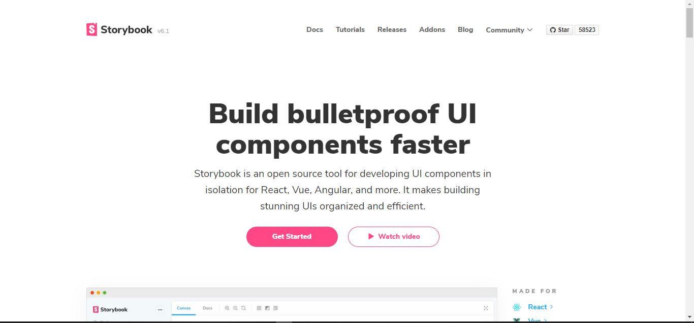

# What is Storybook ?

> "Storybook is a tool for UI development. It makes development faster and easier by isolating components. This allows you to work on one component at a time. You can develop entire UIs without needing to start up a complex dev stack, force certain data into your database, or navigate around your application."

# Why is it useful ?

*   It allows you create componenets independently and showcase them in an independent environment.
*   It gives you the ability to view components that have already been developed and the different props they accept.
*   You can visually showcase the components.

# What is a Story?

You will probably see the term 'story' or 'stories' a lot through this article.

As defined by [Storybook](https://storybook.js.org/docs/react/get-started/whats-a-story), a story captures the rendered state of a UI component. Developers write multiple stories per component that describe all the “interesting” states a component can support.

A story is a basically function that describes how to render the component in question. They are written in Component Story Format (CSF), an ES6 modules-based standard for writing component examples.

## Install Storybook

> Note: Storybook needs to be installed into a project that is already setup with a framework. It will not work on an empty project.

# Does this only work with React ?

No. It also supports many other framworks such as ReactNative, Vue, Svelte, Angular.

To do that we run the command `npx sb init`.

This will create a stories folder because it doesn't know the architecture of your project, later on, we will move those to be right next to our componenets because we want to be right next to each other.

Now that's done, if we go into our package.json, we'll see that, it has reated two new scripts for use, storybook and build-storybook (which we would run when we want to deploy it).

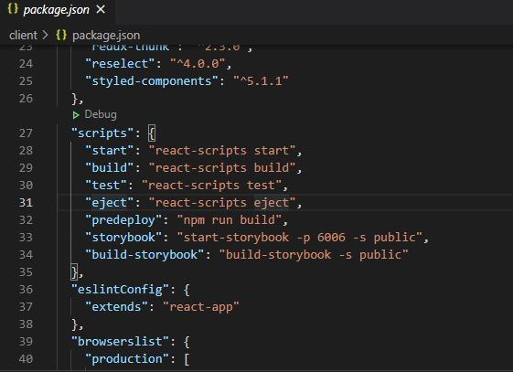

It also generates two new folders, .storybook and stories folders. In the main.js file in .storybook folder, we find the addons array, which we need to update anytime we use an addon.

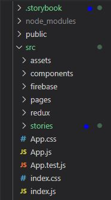

Storybook will treat any file ending in `.stories.(mdx|ts|tsx|js)` as a story.

Now I will be deleting the stories folder, because like I said earlier, we actually want to be crating stories right next to the components.

# Let's write a Story

Let's head over to the components folder. Head to the component you want to write a story for, then create a file named component-name.stories.js. Of course, the naming convention isn't rigid, but its a good way to help you keep track of your stories vs. the component they're about.

For this example, I'll be creating a story for the `custom-button` component.

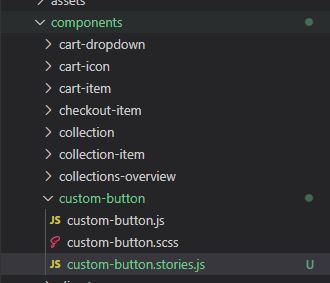

First we make the necessary imports.

```jsx
import React from 'react'
//we import the component we are writing a story about
import CustomButton from './custom-button'
```

As I stated earlier, we write stories in Component Story Format i.e. it has one default export and one or more named export.

```jsx
import React from 'react'
//we import the component we are writing a story about
import CustomButton from './custom-button'

export default {
    //title is mandatory and unique, it shows up on the left panel in storybook
    title: 'CustomButton',
    //component is optional, but some featues rely on this property
    component: CustomButton
}
```

If you have named exports, they are created under the default title. Let's add a few

```jsx
import React from 'react'
//we import the component we are writing a story about
import CustomButton from './custom-button'

export default {
    //title is mandatory and unique, it shows up on the left panel in storybook
    title: 'CustomButton',
    //component is optional, but some featues rely on this property
    component: CustomButton
}

export const PrimaryButton = () => <CustomButton>Primary</CustomButton>
export const SecondaryButton = () => <CustomButton>Secondary</CustomButton>
export const TetiaryButton = () => <CustomButton>Tetiary</CustomButton>
```


As you can see from the gif, without having to worry about the application requirements or logic, you can create and visualize components in isolation.

# Can I have a Story within a Story ?

Yes you can. This is expecially useful when you want to put multiple componenets together to form a complete flow. Before, we go ahed to do that, let's create a story for the form-input components.

```jsx
import React from 'react'
import FormInput from './form-input'

export default {
    title: 'Input',
    component: FormInput
}

export const Input = () => <FormInput/>
```

Let's create a folder called Forms, where we will make use of FormInput story and Button story to create stories within stories.

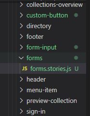

```jsx
import React from 'react'
//we import the stories we would be making use of
import {PrimaryButton} from '../custom-button/custom-button.stories'
import {Input} from '../form-input/form-input.stories'

export default {
    title: "combination",
}

export const Forms = () => (
    <>
        <Input/>
        <PrimaryButton/>
    </>
)
```

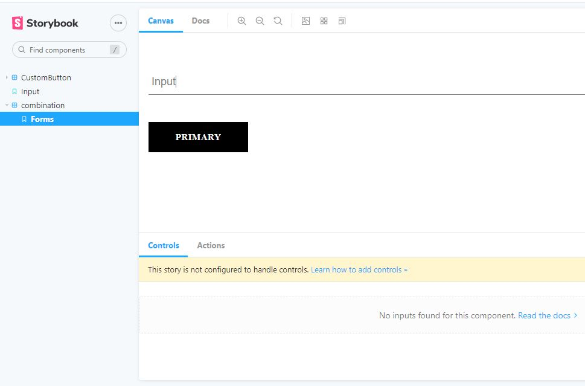

# Why use stories within stories ?

*   Reduces amount of code you need to write
*   Updating a story will wupdate where it is nested (i.e. any update to PrimaryButton will automatically update Forms)

# Args mechanism


Introduced in Storybook v6, each story is considered to be a component with a set of arguments, such as props. Args can be set at component level to be applied to all the stories, but if set at Story level, it will override any args from component level.

For a sample, we'll create a Story and pass placeholder as args.

```jsx
import React from 'react'
import FormInput from './form-input'

export default {
    title: 'Input',
    component: FormInput
}

export const Input = () => <FormInput/>


const Template = args => <FormInput {...args}/>

export const InputWithArgs = Template.bind({})
InputWithArgs.args = {
    placeholder: 'PrimaryWithArgs',
}
```

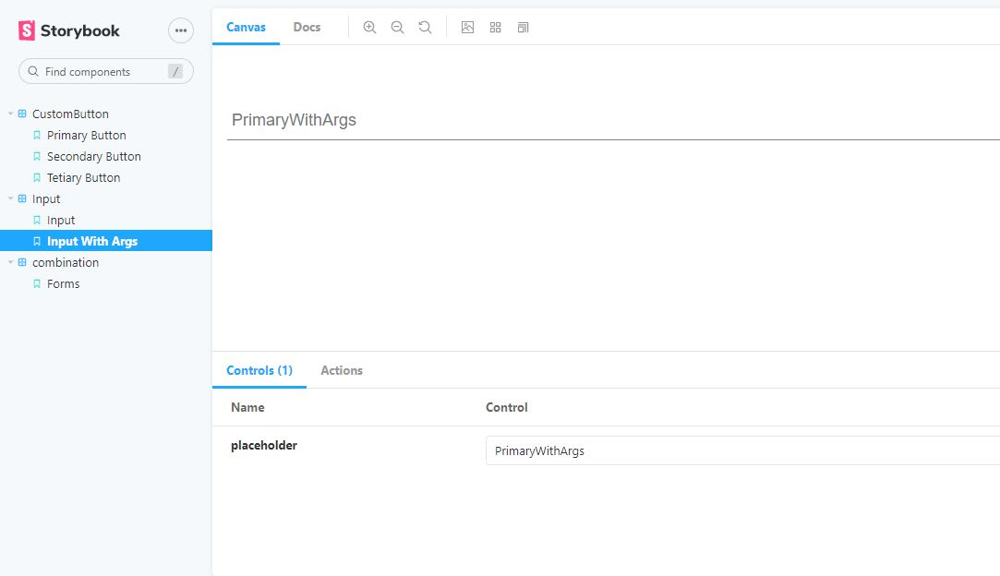

## What are Addons ?

This are extra features we can add to make Storybook more useful. Storybook installs some essential addons on install or us. Some of which are:

*   Docs Addon: This is located right next to the canvas tab. It gives you access to the view the code for a component.

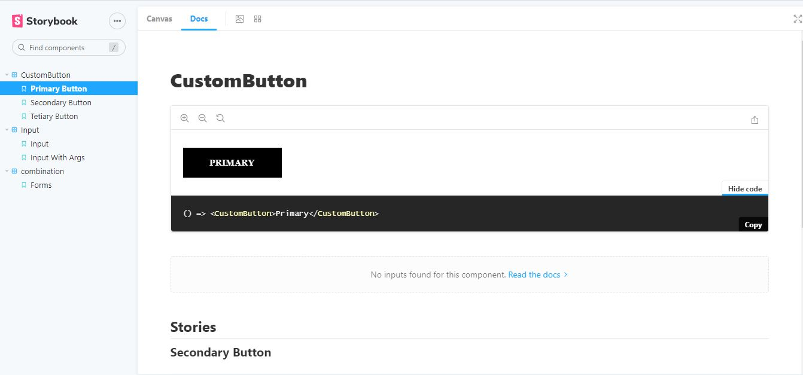

* Background Addon: This helps us change background colors, which might come in handy when we might have components whose colours might be the same as the background, various options help aid visibility of the components.

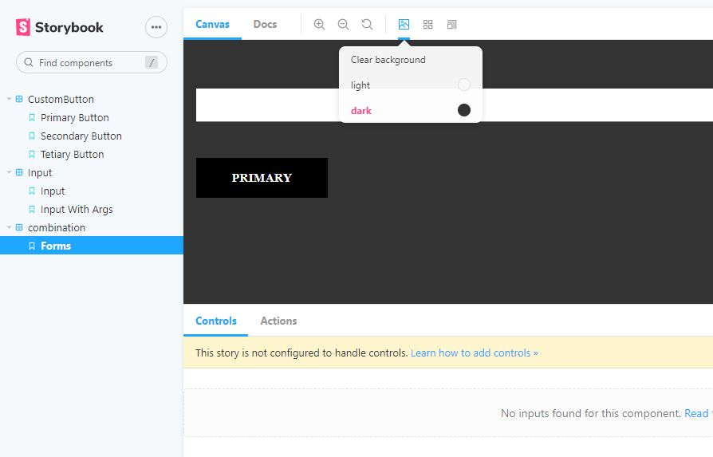

*   Controls Addon: This lets you change the argument for a story.

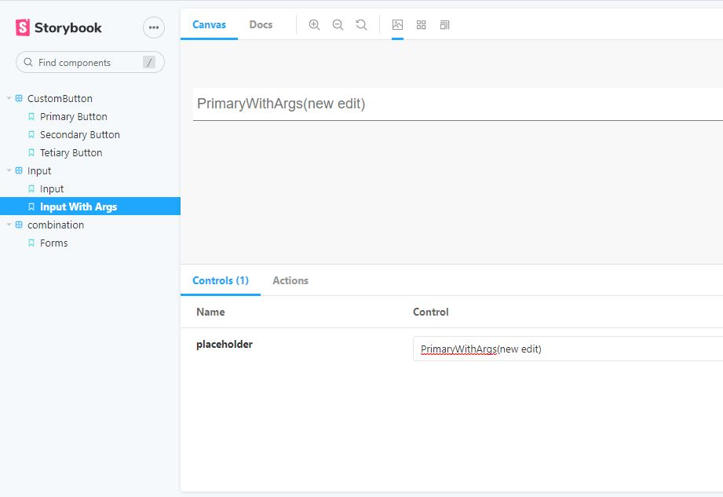

*   Actions Addon: It is located right next to controls. It lets you keep tabs of user actions.
To try this out, let's add an onclick to our FormInput story, so that any time, the input is clicked, it gets logged in the actions tab.

```jsx
import React from 'react'
import FormInput from './form-input'

export default {
    title: 'Input',
    component: FormInput,
    argTypes: {
        onClick: {action: 'clicked'}
    }
}

export const Input = () => <FormInput/>


const Template = args => <FormInput {...args}/>

export const InputWithArgs = Template.bind({})
InputWithArgs.args = {
    placeholder: 'PrimaryWithArgs',
}

```

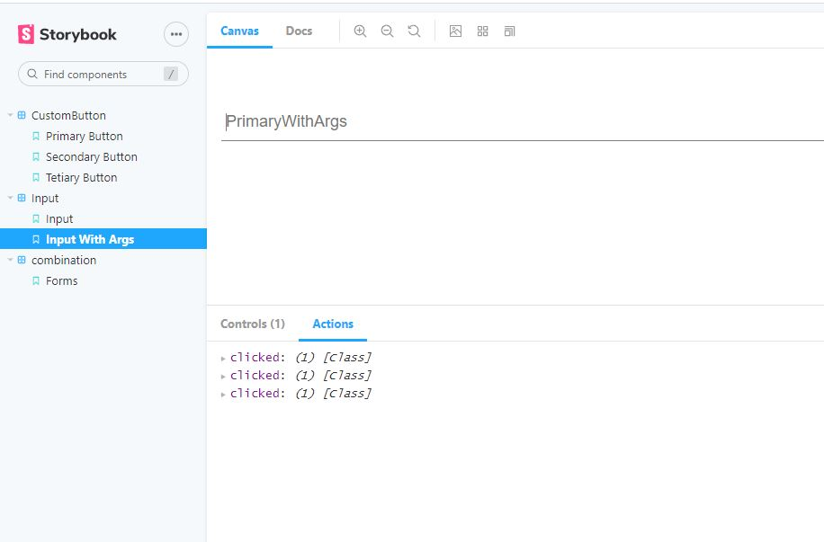

*   Viewport Addon: This let's you test the responsiveness of various componenets by choosing a viewport size.

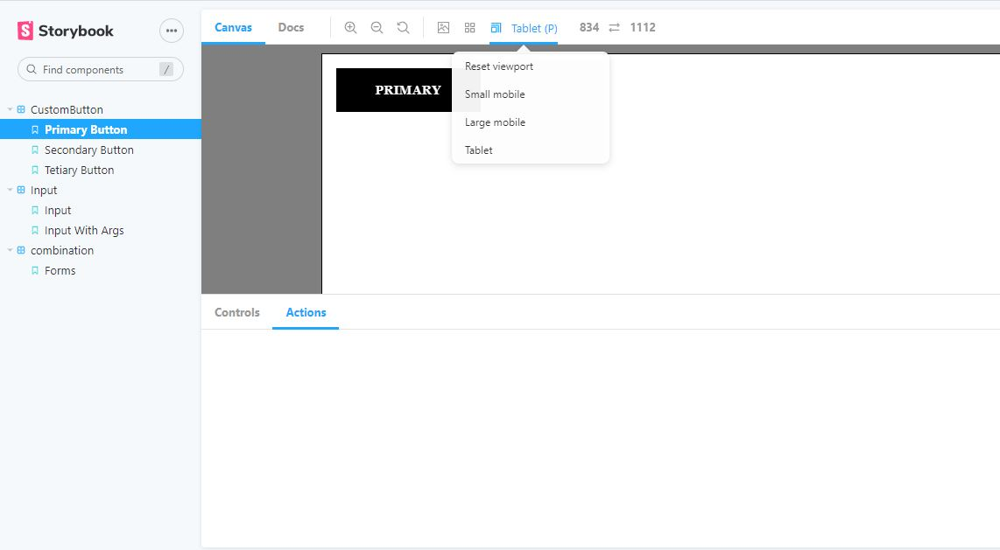

# Deploying Your Storybook

First we need to run the build-story book script `npm build-storybook`, which builds our Storybook into a static web application which we would deploy to a platform of our choice.

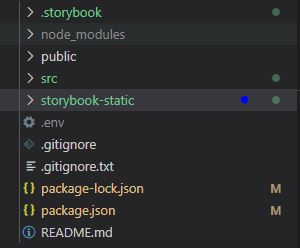

If want a quick guide on how to deploy with netlify, check out my [previous article](https://codexplorer.me/posts/deploying-with-netlify).

> Note: When deploying, don't forget to change your build command to `npm run build-storybook` and publish directory to `storybook-static/`