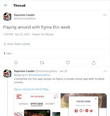
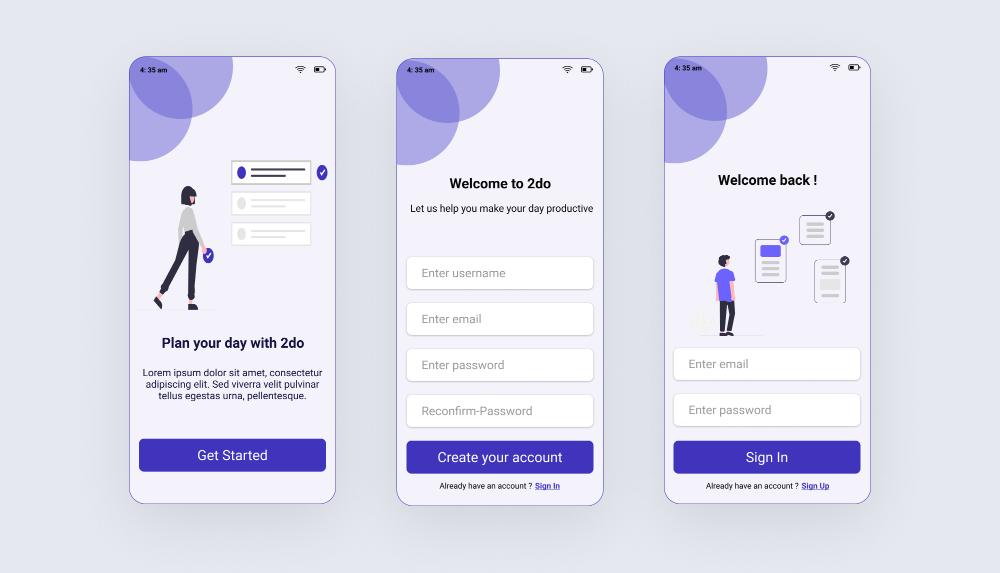
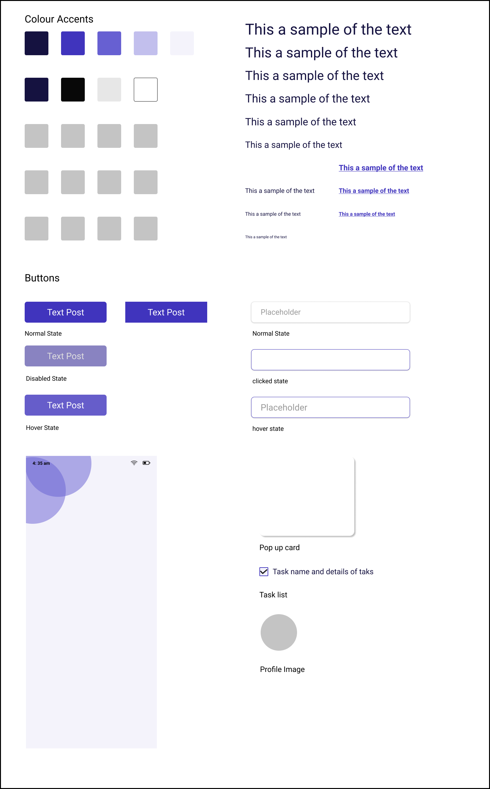
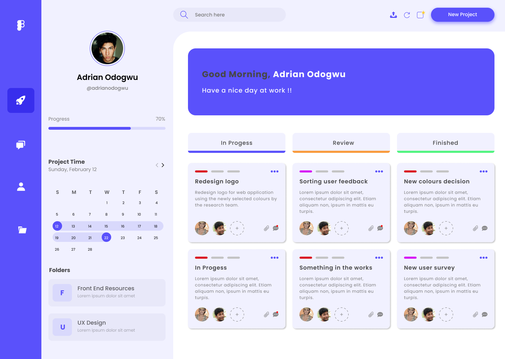
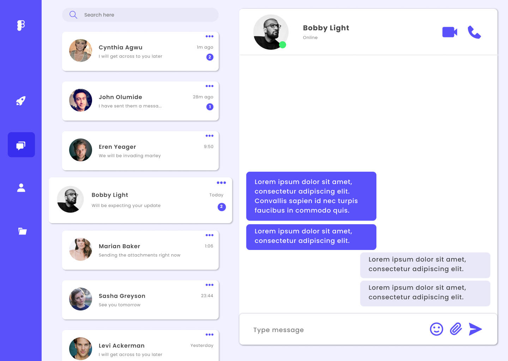
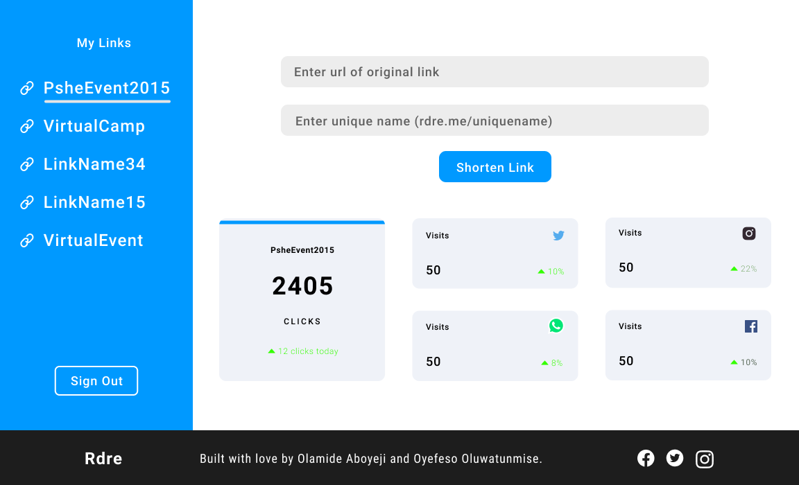
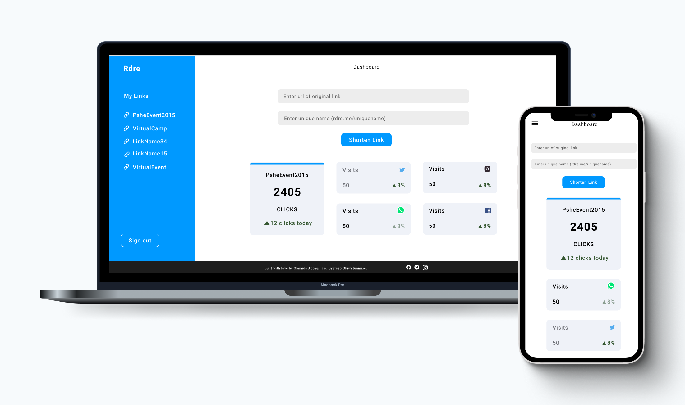

## Playing around with Figma.

A couple of weeks ago I decide to play around with Figma at least once a week.

The whole purpose of this exercise is to help me learn about 3 things majorly: wireframes and prototyping, useability testing and interaction design.
I’ve been following the course outline of ‘Clueless To Designer’, which has been great so far.
After creating my first  design, which was an on-boarding of a To-do application to help me get acclimated to using Figma. 

## Design 1

> The onboarding screens

> Tried creating a design system to help me practice, also incase I intend on adding more screens later.

## Design 2

I then progressed to something more challenging. I design a dashboard following an instructional video, then challenged myself to design the messaging section, following the same design theme as the dashboard.

> Dashboard design.

> Messaging Section (I believe I did an okay job 🌚).

## Design 3

For my most recent design, we were going to be implementing a simple dashboard for a url shortener I built with some folks from my MLSA community last year (https://rdre.me). This dashboard should enable users to see how their links are performing and a history of all their shortened links.

When designing, its always a great idea to ask for feedback. Below, I attached a snippet of the initial design I created for the dashboard, and the design after being review by [Princess Oviawe](https://twitter.com/OviawePrincess). Notice how what might be considered as little changes greatly improved the design (reduced text size, dashboard description and alignment of left navbar.).

> The initial design before review.

> The design after making some change.

Thanks for staying to the end and learning about my progress. Feel free to follow me on Behance to check out some of my future designs.